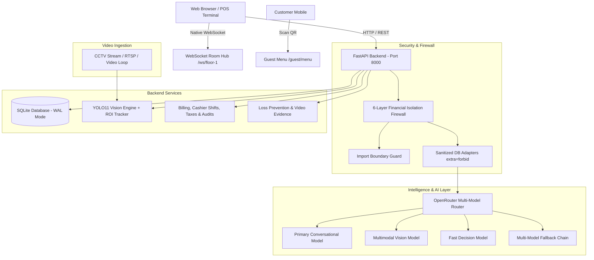

# FOH Table Management Enterprise 🍽️⚡

> **Next-Generation Restaurant Front-of-House Operating System** with Real-Time YOLO11 Computer Vision, OpenRouter Multi-Model AI Control Layer, Zero-Trust Financial Isolation Firewall, Live Synchronized Table Map, POS Billing & Shifts, Loss Prevention, and Guest QR Ordering.

[](https://fastapi.tiangolo.com)
[](https://react.dev)
[](https://www.typescriptlang.org)
[](https://docs.ultralytics.com)
[](https://openrouter.ai)
[](https://www.sqlite.org/wal.html)
[](https://python.org)

👉 **For comprehensive technical sequence diagrams and data flow details, see [SYSTEM_PIPELINE.md](SYSTEM_PIPELINE.md).**

---

## 📑 Table of Contents

- [Overview](#-overview)
- [Enterprise Architecture](#️-enterprise-architecture)
- [System Requirements](#-system-requirements)
- [Quick Start Guide (Ready in 2 Minutes)](#-quick-start-guide-ready-in-2-minutes)
- [Demo Staff Credentials](#-demo-staff-credentials)
- [Core Modules & Capabilities](#-core-modules--capabilities)
  - [1. OpenRouter-Powered Owner AI Control Layer](#1-openrouter-powered-owner-ai-control-layer)
  - [2. Zero-Trust Architectural Financial Firewall (L1–L6)](#2-zero-trust-architectural-financial-firewall-l1l6)
  - [3. FOH Floor Map & Real-Time Sync](#3-foh-floor-map--real-time-sync)
  - [4. Computer Vision & CCTV Table State Pipeline](#4-computer-vision--cctv-table-state-pipeline)
  - [5. POS Billing, Shifts & Payment Processing](#5-pos-billing-shifts--payment-processing)
  - [6. Loss Prevention & Walkout Detection](#6-loss-prevention--walkout-detection)
  - [7. Kitchen Display System (KDS) & Waiter Flow](#7-kitchen-display-system-kds--waiter-flow)
  - [8. Guest QR Menu & Self-Ordering](#8-guest-qr-menu--self-ordering)
  - [9. Menu Management, Excel Import & Versioning](#9-menu-management-excel-import--versioning)
- [High-Concurrency Database Architecture (SQLite WAL)](#-high-concurrency-database-architecture-sqlite-wal)
- [Environment Variables (.env)](#️-environment-variables-env)
- [API Endpoints Cheat Sheet](#-api-endpoints-cheat-sheet)
- [Developer Testing & Quality Assurance](#-developer-testing--quality-assurance)
- [Troubleshooting & Gotchas](#️-troubleshooting--gotchas)

---

## 🌟 Overview

**FOH Table Management Enterprise** bridges digital restaurant operations with physical dining spaces. Ceiling-mounted CCTV cameras continuously monitor table zones using custom computer vision models to track whether tables are **Clean**, **Occupied**, or **Dirty**. 

Staff interact with an ultra-responsive floor plan synchronized instantly over WebSockets, while an integrated **OpenRouter-powered Owner AI Operating Layer** enables natural language command and control, camera anomaly inspection, and operational analytics—all protected by a **6-layer zero-trust financial firewall** that guarantees absolute confidentiality of billing and revenue data.

---

## 🏗️ Enterprise Architecture



---

## 💻 System Requirements

- **Python**: `3.10` to `3.13` (*Note: Python 3.14 is currently not supported by PyO3/pydantic-core*)
- **Node.js**: `20.19+` or `22+`
- **Operating System**: Windows 10/11, macOS, or Linux
- **AI Keys (Optional / Recommended)**: 
  - [OpenRouter API Key](https://openrouter.ai/keys) for multi-model routing (DeepSeek, Claude, GPT, Gemini).
  - Alternative legacy providers: Groq ([console.groq.com](https://console.groq.com/keys)) or Google Gemini.

---

## 🚀 Quick Start Guide (Ready in 2 Minutes)

### 1. Set Up Backend

Open your terminal (PowerShell on Windows, or Bash on macOS/Linux):

```bash
# 1. Navigate to backend directory
cd backend

# 2. Create virtual environment
python -m venv .venv

# 3. Activate virtual environment
# Windows (PowerShell):
.venv\Scripts\Activate.ps1
# macOS/Linux:
source .venv/bin/activate

# 4. Install dependencies
pip install -r requirements.txt

# 5. Start the backend with live reload
python -m uvicorn app.main:socket_app --host 127.0.0.1 --port 8000 --reload
```

*The backend will automatically create and seed `foh.db` in WAL mode with sample floor plans, 10 tables, demo staff, active cashier shift, and menu items.*

### 2. Set Up Frontend

In a **second** terminal window:

```bash
# 1. Navigate to frontend directory
cd frontend

# 2. Install dependencies
npm install

# 3. Start Vite dev server
npm run dev
```

### 3. Open in Browser

- **Application URL**: [http://localhost:5173](http://localhost:5173)
- **Interactive Swagger API Docs**: [http://127.0.0.1:8000/docs](http://127.0.0.1:8000/docs)
- **Redoc Documentation**: [http://127.0.0.1:8000/redoc](http://127.0.0.1:8000/redoc)

---

## 👥 Demo Staff Credentials

The system seeds 6 distinct demo personas representing every front-of-house and back-of-house role:

| Role | Email | Password | Permissions & Primary Scope |
|:---|:---|:---|:---|
| **Owner** | `owner@gmail.com` | `Owner@1234` | Full system access, users, operational AI control, audits |
| **Manager** | `manager@gmail.com` | `Manager@1234` | Shift management, refund approvals, floor layouts, AI config |
| **Host** | `host@gmail.com` | `Host@1234` | Seating guests, reservations, waitlists, table assignments |
| **Cashier** | `cashier@gmail.com` | `Cashier@1234` | Billing, payment processing (Cash/Card/UPI), shift start/end |
| **Waiter** | `waiter@gmail.com` | `Waiter@1234` | Taking orders, serving tables, requesting bills, cleaning alerts |
| **Chef** | `chef@gmail.com` | `Chef@1234` | Kitchen Display System (KDS), bumping order tickets, 86 items |

*(Legacy logins `owner@foh.demo` with password `demo1234` are also retained for backwards compatibility).*

---

## 🧩 Core Modules & Capabilities

### 1. OpenRouter-Powered Owner AI Control Layer
- **Multi-Model Orchestration**: Connects to OpenRouter for access to leading foundation models:
  - **Primary Model**: DeepSeek Chat, Claude 3.5 Sonnet, GPT-4o.
  - **Vision Model**: Gemini Flash 1.5, GPT-4o.
  - **Decision Model**: GPT-4o Mini.
  - **Automatic Fallback Chain**: Transparently falls back to secondary models if primary encounters rate limits or errors.
- **Hands-Free Operations & Dynamic UI Navigation**:
  - *"Which tables are occupied?"* ➔ Direct response + auto-navigates to `/floor?status=occupied`.
  - *"Show camera mismatches"* ➔ Direct response + navigates to `/camera-setup`.
  - *"Check reservations for tonight"* ➔ Auto-navigates to `/reservations`.
  - Action badges returned by the AI are rendered as interactive chips in the UI widget.
- **Deterministic Temporal Engine**:
  - Uses `resolve_date_expression` to convert relative queries (*"today"*, *"yesterday"*, *"last night"*) into precise UTC datetime ranges, preventing LLM time hallucinations.
- **In-Widget Provider & API Key Setup**: Click the **⚙** gear icon on the floating assistant pill to set an OpenRouter, Groq, or Gemini key with zero server restart.

### 2. Zero-Trust Architectural Financial Firewall (L1–L6)
- **Absolute Billing Isolation**: The AI intelligence layer has **ZERO access** to confidential financial data (bills, revenue, payments, taxes, refunds, discounts, cashier cash drawers). This applies **even to authenticated Owner users**.
- **Defense-in-Depth Enforcement**:
  1. **L1 Request Firewall**: Immediate regex and keyword rejection before invoking LLMs.
  2. **L2 RBAC & Policy Guard**: Strict permissions validation (`ai.assistant.use`).
  3. **L3 Import Boundary Guard**: Hard AST checks preventing imports of billing models (`Bill`, `Payment`, etc.) in the AI packages.
  4. **L4 Sanitized DB Adapters**: Database queries use strict Pydantic models with `extra="forbid"` returning only operational counts and timestamps.
  5. **L5 Egress & Response Scanner**: Scans tool outputs and LLM text to scrub any accidental monetary expressions.
  6. **L6 Persistence Redactor**: Masks all sensitive keys before persisting immutable records to `AIAuditEvent`.

### 3. FOH Floor Map & Real-Time Sync
- **Interactive Canvas**: Drag-and-drop table layout editor with sections (Indoor, Outdoor/Patio, Bar).
- **Table Lifecycle State Machine**: Strictly enforces legal transitions:
  `AVAILABLE` ➔ `SEATED` ➔ `ORDERED` ➔ `SERVED` ➔ `BILLING` ➔ `PAID` ➔ `CLEANING` ➔ `AVAILABLE`.
- **WebSocket Synchronization**: Emits updates to `/ws/floor-1` rooms. Any status change made by a waiter, cashier, or camera instantly updates all active staff screens without refreshing.

### 4. Computer Vision & CCTV Table State Pipeline
- **Dual Model Engine**:
  - `yolo11n.pt`: Detects persons, dishware, and general table activity.
  - `table_cleanliness_best.pt`: Specialized model trained on restaurant table states (`clean`, `dirty`, `occupied`).
- **Region of Interest (ROI) Calibration**: Draw precise bounding boxes over camera frames for each table with auto-detection assistance.
- **Live Stream Relay**: MJPEG stream served at `/stream/{floor_id}` with live bounding boxes and confidence overlays.
- **Video Source Flexibility**: Supports live Webcams, RTSP camera streams, YouTube Live URLs, or looping MP4 clips from `backend/camera_uploads/`.

### 5. POS Billing, Shifts & Payment Processing
- **Cashier Shifts**: Start shift with opening float, record drawer reconciliation at close with automatic discrepancy calculation.
- **Itemized GST & Service Charges**: Accurate computation compliant with hospitality tax standards.
- **Flexible Payment Methods**: Cash, Credit/Debit Card, UPI / QR, Online Payment Gateway.
- **Manager Approval Workflow**: Cashiers can request discounts or refunds; approvals over threshold require Manager/Owner PIN.

### 6. Loss Prevention & Walkout Detection
- **Edge-Triggered Detection**: Automatically detects when guests leave a table that is in `BILLING` status before payment confirmation.
- **Incident Modal**: Displays captured video frame evidence and provides resolution tags (`PAID_COUNTER`, `FALSE_ALARM`, `LOGGED_UNRECOVERED`).

### 7. Kitchen Display System (KDS) & Waiter Flow
- Real-time station routing (Grill, Fry, Salad, Bar).
- Ticket timer alerts for delayed items.
- One-click cook/bump status updates.

### 8. Guest QR Menu & Self-Ordering
- Scan table QR code to open `/guest/menu?token=<token>`.
- Responsive mobile menu with item details, dietary tags (Veg/Non-Veg), and real-time total.
- **Digital Waiter Bell**: Guests can tap *"🔔 Call Waiter"* or *"🧾 Request Bill"* directly from their phone.

### 9. Menu Management, Excel Import & Versioning
- Upload menu `.xlsx` or `.csv` spreadsheets.
- **Staging Review Table**: Highlights new items, price changes, duplicate codes, and deactivated items before applying.
- **Version History & Rollback**: Maintain complete revision logs with one-click restore.

---

## ⚡ High-Concurrency Database Architecture (SQLite WAL)

To guarantee high throughput on Windows environments without locking or hanging:
- **Write-Ahead Logging**: SQLite runs with `PRAGMA journal_mode=WAL`, enabling concurrent readers to query the database simultaneously without blocking background camera or kitchen writes.
- **Busy Timeout**: Configured with `PRAGMA busy_timeout=15000` to smoothly handle high-concurrency bursts.
- **Synchronous Normal**: Runs `PRAGMA synchronous=NORMAL` for optimal I/O throughput.
- **Sub-Second Graceful Shutdown**: Background workers utilize cooperative `threading.Event()` cancellation signals and bounded `asyncio.wait_for` timeouts, allowing clean server shutdowns in under **0.1 seconds**.

---

## ⚙️ Environment Variables (.env)

Configuration is loaded from `backend/.env` (or root `.env`):

| Variable | Default Value | Description |
|:---|:---|:---|
| `DATABASE_URL` | `sqlite:///./foh.db` | SQLite file location or PostgreSQL connection string |
| `JWT_SECRET` | `dev-secret-change-in-production` | Secret key used for signing JWT tokens |
| `JWT_EXPIRE_HOURS` | `8` | Token expiration duration |
| `CORS_ORIGINS` | `http://localhost:5173,...` | Allowed CORS origins for frontend connections |
| `OPENROUTER_API_KEY` | *(empty)* | OpenRouter API Key for multi-model access |
| `AI_PROVIDER` | `openrouter` | Active AI provider (`openrouter`, `groq`, `gemini`, `local`) |
| `AI_PRIMARY_MODEL` | `deepseek/deepseek-chat` | Primary conversational LLM model |
| `AI_VISION_MODEL` | `google/gemini-flash-1.5` | Multimodal model for CCTV and image inspection |
| `AI_DECISION_MODEL` | `openai/gpt-4o-mini` | Fast model for classification and action routing |
| `AI_FALLBACK_MODELS` | `["meta-llama/llama-3.3-70b-instruct"]` | JSON array of fallback models |
| `GROQ_API_KEY` | *(empty)* | Legacy Groq API key |
| `GEMINI_API_KEY` | *(empty)* | Google Gemini API key |
| `CAMERA_ENABLED` | `true` | Toggles background computer vision processing loop |
| `CAMERA_SCAN_INTERVAL_SECONDS` | `10` | Frequency in seconds between camera analysis ticks |
| `CV_MODEL_NAME` | `yolo11n.pt` | Base YOLO model file |

---

## 📡 API Endpoints Cheat Sheet

Interactive documentation with live requests is available at [http://127.0.0.1:8000/docs](http://127.0.0.1:8000/docs).

### Authentication & Staff
- `POST /auth/login` — Login with email/password, returns JWT token.
- `GET /auth/me` — Return current authenticated user profile and permissions.
- `GET /users` — List staff members (Manager/Owner only).

### Owner AI Operating Layer & Alerts
- `POST /ai/chat` — Natural language chat endpoint with multi-turn history & route action generation.
- `GET /ai/provider` — Returns active AI provider, model routing, and firewall status.
- `POST /ai/configure-key` — Persist and hot-reload AI API keys (Owner only).
- `GET /ai/events` — Fetch open AI alerts (cleaning escalation, camera mismatch).
- `PATCH /ai/events/{id}/resolve` — Mark alert as resolved.

### Floor & Table Management
- `GET /floors/current` — Get current floor layout, tables, coordinates, and statuses.
- `PATCH /tables/{id}/status` — Update table status (validated by state machine).
- `POST /sessions/seat` — Seat guests and assign a dining session.
- `POST /sessions/{id}/close` — Close dining session upon departure.

### Billing & Cashier Shifts (Human Only)
- `POST /cashier-shifts/start` — Start cashier shift with opening cash amount.
- `PATCH /cashier-shifts/{id}/end` — Close cashier shift and reconcile drawer.
- `POST /billing/bills` — Generate itemized bill for a table.
- `POST /billing/bills/{id}/pay` — Record payment (CASH, CARD, UPI, QR).
- `POST /refunds` — Create refund request (requires Manager approval).

---

## 🧪 Developer Testing & Quality Assurance

Run the built-in automated test suites to verify that the backend, AI security boundaries, and frontend are healthy:

```bash
# 1. Run AI Agent Security & Financial Firewall Test Suite (100% Pass)
cd backend
pytest tests/test_ai_agent_phase1.py

# 2. Run Full Backend Enterprise Flow Tests
python test_full_suite.py

# 3. Check Frontend TypeScript Compilation & Build
cd ../frontend
npm run build
```

---

## 🛠️ Troubleshooting & Gotchas

#### 1. AI Safely Refuses Billing Questions
- **Behavior**: Asking questions like *"What is today's revenue?"* or *"Show me table 1's bill"* returns:
  > *"Billing, payment, and financial information is strictly isolated and cannot be accessed via the AI Assistant."*
- **Reason**: By design! The 6-layer financial firewall enforces complete isolation for business security, even for Owners.

#### 2. Switching AI Providers / Models
- Open the FOH Assistant widget in the bottom right corner of the UI, click **⚙**, select **OpenRouter** (or **Groq** / **Gemini**), paste your key, and click **Activate**. It reconfigures instantly without restarting the server.

#### 3. WebSocket Connection 403 Forbidden
- **Cause**: Connecting to `/ws/{floor_id}` without a valid JWT token query parameter.
- **Fix**: The frontend `SocketContext` automatically appends `?token=<access_token>` to all socket handshakes once logged in.

#### 4. Database Concurrency & Windows File Locks
- SQLite is pre-configured with Write-Ahead Logging (`WAL`) mode and a 15-second busy timeout. If you ever need to inspect the database directly while uvicorn is running, use tools that respect SQLite WAL mode.

---

**Built with pride for high-throughput restaurant operations.**
