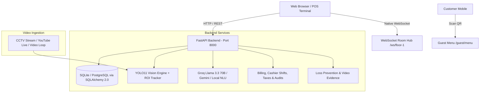

# FOH Table Management Enterprise 🍽️⚡

> **Next-Generation Restaurant Front-of-House Operating System** with Real-Time YOLO11 Computer Vision, Conversational AI Assistant (Groq / Gemini / OpenAI), Live Table Map, POS Billing & Shifts, Loss Prevention, and Guest QR Ordering.

[](https://fastapi.tiangolo.com)
[](https://react.dev)
[](https://www.typescriptlang.org)
[](https://docs.ultralytics.com)
[](https://groq.com)
[](https://python.org)

---

## 📑 Table of Contents

- [Overview](#overview)
- [Enterprise Architecture](#enterprise-architecture)
- [System Requirements](#system-requirements)
- [Quick Start Guide (Ready in 2 Minutes)](#quick-start-guide-ready-in-2-minutes)
- [Demo Staff Credentials](#demo-staff-credentials)
- [Core Modules & Capabilities](#core-modules--capabilities)
  - [1. FOH Floor Map & Real-Time Sync](#1-foh-floor-map--real-time-sync)
  - [2. AI Conversational Assistant & Key Setup](#2-ai-conversational-assistant--key-setup)
  - [3. Computer Vision & CCTV Table State Pipeline](#3-computer-vision--cctv-table-state-pipeline)
  - [4. POS Billing, Shifts & Payment Processing](#4-pos-billing-shifts--payment-processing)
  - [5. Loss Prevention & Walkout Detection](#5-loss-prevention--walkout-detection)
  - [6. Kitchen Display System (KDS) & Waiter Flow](#6-kitchen-display-system-kds--waiter-flow)
  - [7. Guest QR Menu & Self-Ordering](#7-guest-qr-menu--self-ordering)
  - [8. Menu Management, Excel Import & Versioning](#8-menu-management-excel-import--versioning)
- [Environment Variables (.env)](#environment-variables-env)
- [API Endpoints Cheat Sheet](#api-endpoints-cheat-sheet)
- [Developer Testing & Quality Assurance](#developer-testing--quality-assurance)
- [Troubleshooting & Gotchas](#troubleshooting--gotchas)

---

## 🌟 Overview

FOH Table Management Enterprise bridges digital restaurant operations with physical dining spaces. Ceiling-mounted CCTV cameras continuously monitor table zones using custom computer vision models to track whether tables are **Clean**, **Occupied**, or **Dirty**. Staff interact with a real-time floor plan synchronized instantly over WebSockets, while an integrated AI Assistant allows hands-free natural language management (e.g., *"sent bill to t1"*, *"clean table 2"*, *"seat 4 at table 3"*).

---

## 🏗️ Enterprise Architecture



---

## 💻 System Requirements

- **Python**: `3.11` to `3.13` (*Note: Python 3.14 is currently not supported by PyO3/pydantic-core*)
- **Node.js**: `20.19+` or `22+`
- **Operating System**: Windows 10/11, macOS, or Linux
- **Optional**: Free Groq API Key ([console.groq.com](https://console.groq.com/keys)) or Google Gemini API Key for high-speed cloud LLM inference.

---

## 🚀 Quick Start Guide (Ready in 2 Minutes)

### 1. Set Up Backend

Open your terminal (PowerShell on Windows, or Bash on macOS/Linux):

```bash
# 1. Navigate to backend directory
cd backend

# 2. Create virtual environment
python -m venv .venv

# 3. Activate virtual environment
# Windows (PowerShell):
.venv\Scripts\Activate.ps1
# macOS/Linux:
source .venv/bin/activate

# 4. Install dependencies
pip install -r requirements.txt

# 5. Start the backend with live reload
python -m uvicorn app.main:socket_app --host 127.0.0.1 --port 8000 --reload
```

*The backend will automatically create and seed `foh.db` with sample floor plans, 10 tables, demo staff, active cashier shift, and menu items.*

### 2. Set Up Frontend

In a **second** terminal window:

```bash
# 1. Navigate to frontend directory
cd frontend

# 2. Install dependencies
npm install

# 3. Start Vite dev server
npm run dev
```

### 3. Open in Browser

- **Application URL**: [http://localhost:5173](http://localhost:5173)
- **Interactive Swagger API Docs**: [http://127.0.0.1:8000/docs](http://127.0.0.1:8000/docs)
- **Redoc Documentation**: [http://127.0.0.1:8000/redoc](http://127.0.0.1:8000/redoc)

---

## 👥 Demo Staff Credentials

The system seeds 6 distinct demo personas representing every front-of-house and back-of-house role:

| Role | Email | Password | Permissions & Primary Scope |
|:---|:---|:---|:---|
| **Owner** | `owner@gmail.com` | `Owner@1234` | Full system access, users, revenue analytics, audits |
| **Manager** | `manager@gmail.com` | `Manager@1234` | Shift management, refund approvals, floor layouts, AI config |
| **Host** | `host@gmail.com` | `Host@1234` | Seating guests, reservations, waitlists, table assignments |
| **Cashier** | `cashier@gmail.com` | `Cashier@1234` | Billing, payment processing (Cash/Card/UPI), shift start/end |
| **Waiter** | `waiter@gmail.com` | `Waiter@1234` | Taking orders, serving tables, requesting bills, cleaning alerts |
| **Chef** | `chef@gmail.com` | `Chef@1234` | Kitchen Display System (KDS), bumping order tickets, 86 items |

*(Legacy logins `owner@foh.demo` with password `demo1234` are also retained for backwards compatibility).*

---

## 🧩 Core Modules & Capabilities

### 1. FOH Floor Map & Real-Time Sync
- **Interactive Canvas**: Drag-and-drop table layout editor with sections (Indoor, Outdoor/Patio, Bar).
- **Table Lifecycle State Machine**: Strictly enforces legal transitions:
  `AVAILABLE` ➔ `SEATED` ➔ `ORDERED` ➔ `SERVED` ➔ `BILLING` ➔ `PAID` ➔ `CLEANING` ➔ `AVAILABLE`.
- **WebSocket Synchronization**: Emits updates to `/ws/floor-1` rooms. Any status change made by a waiter, cashier, or camera instantly updates all active staff screens without refreshing.

### 2. AI Conversational Assistant & Key Setup
- **FOH Assistant Floating Widget**: Accessible via the `✦` button in the bottom right corner.
- **Natural Language Parsing**:
  - *"Sent bill to t1"* ➔ Sets Table T1 to `BILLING` and alerts cashier.
  - *"Clean table 3"* ➔ Marks Table T3 as `CLEANING` for busser.
  - *"Seat a party of 4 at table 2"* ➔ Seats guests and opens dining session.
  - *"Which tables are free right now?"* ➔ Instant occupancy summary.
  - *"What are today's shift stats?"* ➔ Sales and order recap.
- **In-Widget API Key Setup**: Click the **⚙** gear icon on the assistant pill to open an inline drawer. Paste a free Groq or Gemini key, click **Activate**, and the system will hot-reload cloud intelligence dynamically without restarting the server!

### 3. Computer Vision & CCTV Table State Pipeline
- **Dual Model Engine**:
  - `yolo11n.pt`: Detects persons, dishware, and general table activity.
  - `table_cleanliness_best.pt`: Specialized model trained on restaurant table states (`clean`, `dirty`, `occupied`).
- **Region of Interest (ROI) Calibration**: Draw precise bounding boxes over camera frames for each table with auto-detection assistance.
- **Live Stream Relay**: MJPEG stream served at `/stream/{floor_id}` with live bounding boxes and confidence overlays.
- **Video Source Flexibility**: Supports live Webcams, RTSP camera streams, YouTube Live URLs, or looping MP4 clips from `backend/camera_uploads/`.

### 4. POS Billing, Shifts & Payment Processing
- **Cashier Shifts**: Start shift with opening float, record drawer reconciliation at close with automatic discrepancy calculation.
- **Itemized GST & Service Charges**: Accurate computation compliant with hospitality tax standards.
- **Flexible Payment Methods**: Cash, Credit/Debit Card, UPI / QR, Online Payment Gateway.
- **Manager Approval Workflow**: Cashiers can request discounts or refunds; approvals over threshold require Manager/Owner PIN.

### 5. Loss Prevention & Walkout Detection
- **Edge-Triggered Detection**: Automatically detects when guests leave a table that is in `BILLING` status before payment confirmation.
- **Incident Modal**: Displays captured video frame evidence and provides resolution tags (`PAID_COUNTER`, `FALSE_ALARM`, `LOGGED_UNRECOVERED`).

### 6. Kitchen Display System (KDS) & Waiter Flow
- Real-time station routing (Grill, Fry, Salad, Bar).
- Ticket timer alerts for delayed items.
- One-click cook/bump status updates.

### 7. Guest QR Menu & Self-Ordering
- Scan table QR code to open `/guest/menu?token=<token>`.
- Responsive mobile menu with item details, dietary tags (Veg/Non-Veg), and real-time total.
- **Digital Waiter Bell**: Guests can tap *"🔔 Call Waiter"* or *"🧾 Request Bill"* directly from their phone.

### 8. Menu Management, Excel Import & Versioning
- Upload menu `.xlsx` or `.csv` spreadsheets.
- **Staging Review Table**: Highlights new items, price changes, duplicate codes, and deactivated items before applying.
- **Version History & Rollback**: Maintain complete revision logs with one-click restore.

---

## ⚙️ Environment Variables (.env)

Configuration is loaded from `backend/.env` (or root `.env`):

| Variable | Default Value | Description |
|:---|:---|:---|
| `DATABASE_URL` | `sqlite:///./foh.db` | SQLite file location or PostgreSQL connection string |
| `JWT_SECRET` | `dev-secret-change-in-production` | Secret key used for signing JWT tokens |
| `JWT_EXPIRE_HOURS` | `8` | Token expiration duration |
| `CORS_ORIGINS` | `http://localhost:5173,...` | Allowed CORS origins for frontend connections |
| `GROQ_API_KEY` | *(empty)* | Free API key from [console.groq.com](https://console.groq.com) |
| `GROQ_MODEL` | `llama-3.3-70b-versatile` | Primary conversational AI model |
| `GEMINI_API_KEY` | *(empty)* | Google Gemini API key (optional alternative) |
| `CAMERA_ENABLED` | `true` | Toggles background computer vision processing loop |
| `CAMERA_SCAN_INTERVAL_SECONDS` | `10` | Frequency in seconds between camera analysis ticks |
| `CV_MODEL_NAME` | `yolo11n.pt` | Base YOLO model file |

---

## 📡 API Endpoints Cheat Sheet

Interactive documentation with live requests is available at [http://127.0.0.1:8000/docs](http://127.0.0.1:8000/docs).

### Authentication & Staff
- `POST /auth/login` — Login with email/password, returns JWT token.
- `GET /auth/me` — Return current authenticated user profile and permissions.
- `GET /users` — List staff members (Manager/Owner only).

### Floor & Table Management
- `GET /floors/current` — Get current floor layout, tables, coordinates, and statuses.
- `PATCH /tables/{id}/status` — Update table status (validated by state machine).
- `POST /sessions/seat` — Seat guests and assign a dining session.
- `POST /sessions/{id}/close` — Close dining session upon departure.

### AI Assistant & Alerts
- `GET /ai/provider` — Returns active AI provider (`Groq`, `Gemini`, `Local Engine`).
- `POST /ai/configure-key` — Persist and hot-reload AI API key without restarting server.
- `POST /ai/chat` — Assistant chat endpoint with multi-turn message history.
- `GET /ai/events` — Fetch open AI alerts (cleaning escalation, mismatch).
- `PATCH /ai/events/{id}/resolve` — Mark alert as resolved.

### Billing & Cashier Shifts
- `POST /cashier-shifts/start` — Start cashier shift with opening cash amount.
- `PATCH /cashier-shifts/{id}/end` — Close cashier shift and reconcile drawer.
- `POST /billing/bills` — Generate itemized bill for a table.
- `POST /billing/bills/{id}/pay` — Record payment (CASH, CARD, UPI, QR).
- `POST /refunds` — Create refund request (requires Manager approval).

---

## 🧪 Developer Testing & Quality Assurance

Run the built-in automated test suites to verify that the backend and frontend are healthy:

```bash
# 1. Run full backend enterprise flow tests
cd backend
python test_full_suite.py

# 2. Run AI and table NLU verification
python -c "from app.services.chat_service import _extract_table_number; assert _extract_table_number('sent bill to t1') == '1'; print('NLU Passed!')"

# 3. Check frontend TypeScript compilation
cd ../frontend
npx tsc --noEmit
```

---

## 🛠️ Troubleshooting & Gotchas

#### 1. `IntegrityError: UNIQUE constraint failed: audit_logs.id`
- **Cause**: Re-running database seeders on an existing SQLite database.
- **Fix**: The seeder in `app/seed.py` has been updated with idempotent `db.get(...)` checks on all historical records. If you ever want a totally fresh database, delete `backend/foh.db` and start uvicorn again.

#### 2. AI Assistant says *"Running in local intelligence mode"*
- **Fix**: Open the FOH Assistant widget in the UI, click **⚙**, select **Groq**, paste your free `gsk_...` key from [console.groq.com](https://console.groq.com), and click **Activate**. It will connect instantly without needing to restart the backend.

#### 3. WebSocket Connection 403 Forbidden
- **Cause**: Trying to connect to `/ws/{floor_id}` without a valid JWT token query parameter.
- **Fix**: Ensure your frontend has an active login session; the frontend `SocketContext` automatically appends `?token=<access_token>` to all socket handshakes.

#### 4. Windows PowerShell Script Execution Policy
- If `npm` or `.venv\Scripts\Activate.ps1` is blocked by Windows execution policy, run:
  ```powershell
  Set-ExecutionPolicy -Scope CurrentUser -ExecutionPolicy RemoteSigned
  ```

---

**Built with pride for high-throughput restaurant operations.**
