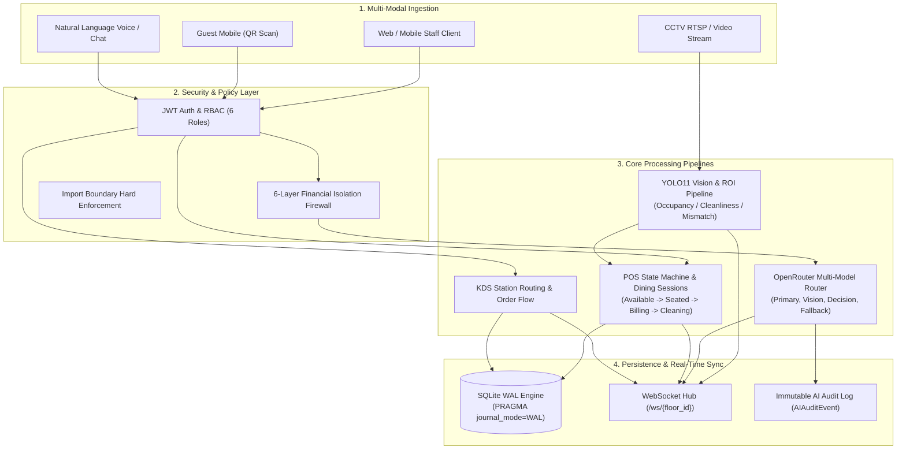
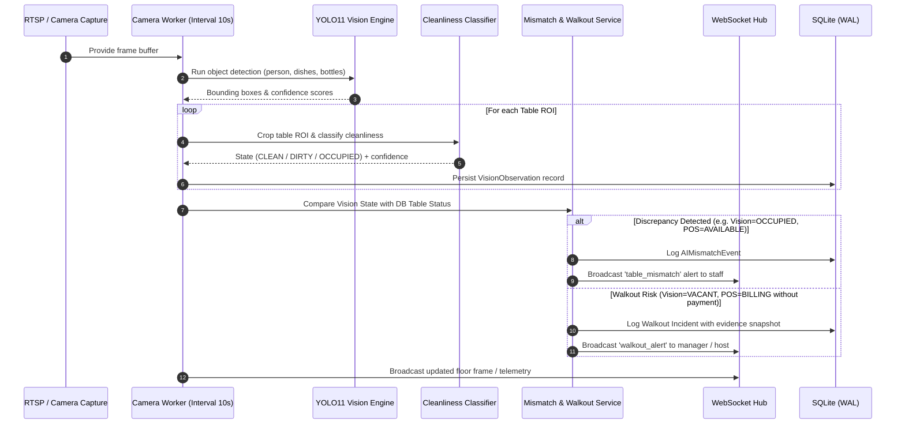
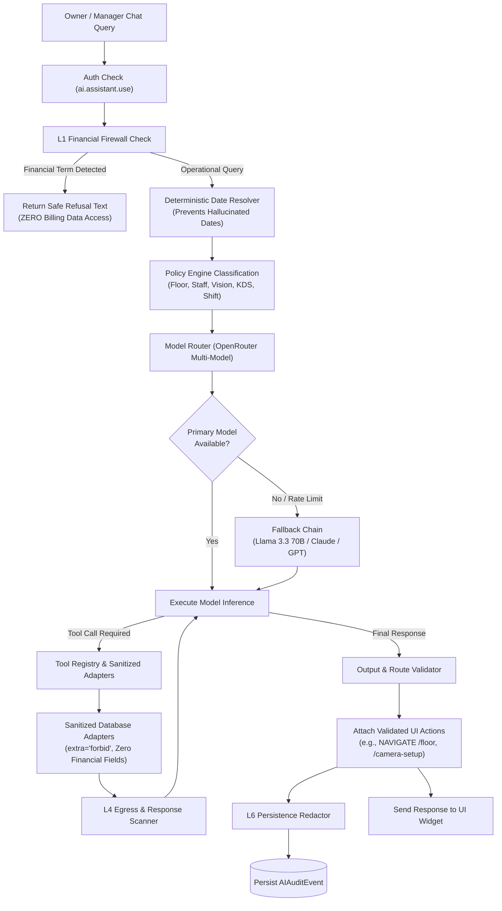
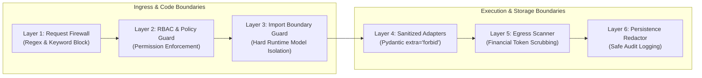
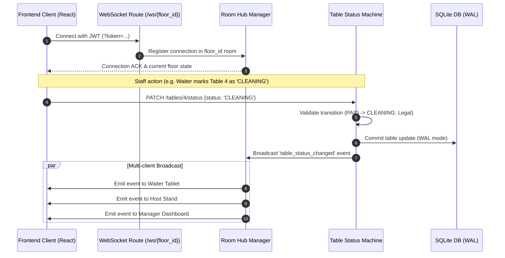
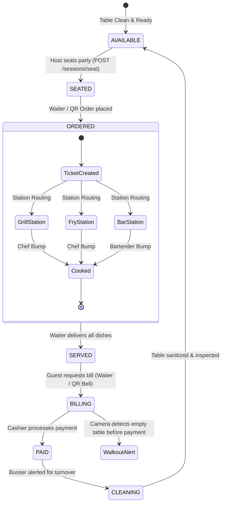
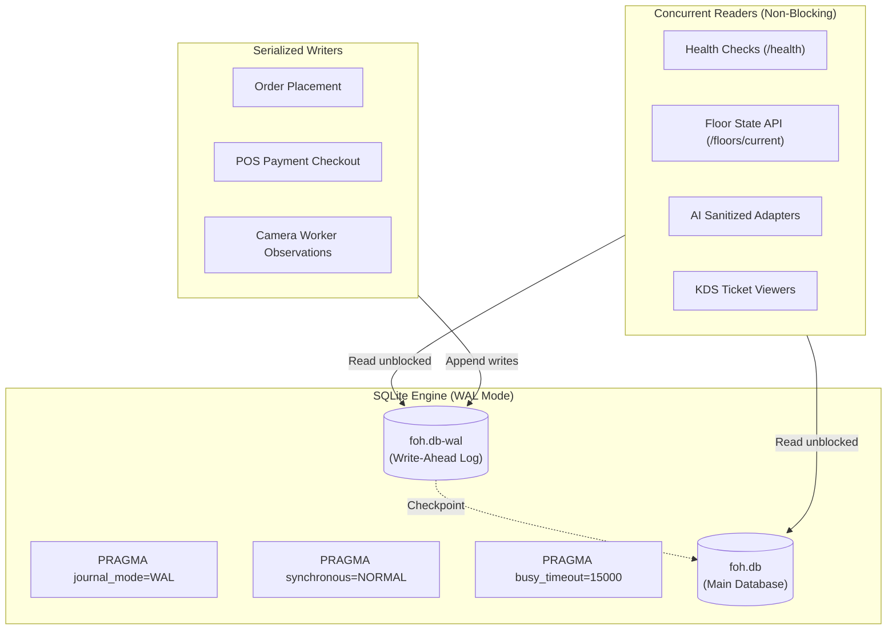

# FOH Enterprise System Pipeline Architecture 🏗️⚡

This document provides a comprehensive end-to-end technical blueprint of the pipelines running across the **FOH Table Management Enterprise** platform. It details data flow, processing stages, decision logic, security guardrails, and real-time synchronization mechanisms.

---

## 📑 Table of Contents

1. [High-Level System Pipeline Architecture](#1-high-level-system-pipeline-architecture)
2. [Computer Vision & CCTV Intelligence Pipeline](#2-computer-vision--cctv-intelligence-pipeline)
3. [Natural Language AI Operating Layer Pipeline](#3-natural-language-ai-operating-layer-pipeline)
4. [Zero-Trust Financial Firewall (6-Layer Isolation Architecture)](#4-zero-trust-financial-firewall-6-layer-isolation-architecture)
5. [Real-Time WebSocket Synchronization Pipeline](#5-real-time-websocket-synchronization-pipeline)
6. [KDS, Order Lifecycle & Dining Session Pipeline](#6-kds-order-lifecycle--dining-session-pipeline)
7. [High-Concurrency Database Engine & Concurrency Pipeline](#7-high-concurrency-database-engine--concurrency-pipeline)

---

## 1. High-Level System Pipeline Architecture

The platform operates across four primary real-time pipelines:

---

## 2. Computer Vision & CCTV Intelligence Pipeline

The vision pipeline ingests live video streams, identifies physical table zones, evaluates table states using deep learning, detects mismatches against the POS system, and triggers loss prevention alerts.

### Vision Pipeline Stages:
1. **Frame Capture & Non-blocking Ingestion (`camera_utils.py`)**:
   - Ingests RTSP feeds, webcams, or pre-recorded MP4 video streams.
   - Employs wall-clock seeking for recorded test files to ensure simulated CCTV mirrors real elapsed time.
   - Protected with bounded acquisition locks (`timeout=1.0s`) to prevent worker deadlock during camera disconnects.
2. **Object Detection (`yolo11n.pt`)**:
   - Detects diners, waitstaff, glasses, plates, and cutleries in the frame with normalized coordinates.
3. **Region of Interest (ROI) Mapping**:
   - Projects normalized table bounding polygons calibrated in the Floor Plan Editor over detection coordinates using Intersection-over-Union (IoU).
4. **Table State Classification (`table_cleanliness_best.pt`)**:
   - High-precision secondary CNN specifically trained on restaurant table states:
     - `CLEAN`: Sanitized table, zero tableware, chairs tucked.
     - `OCCUPIED`: Diners present, active dining.
     - `DIRTY`: Diners departed, unbussed plates and glasses remaining.
5. **Operational Mismatch Engine (`mismatch_service.py`)**:
   - Cross-checks vision truth with system status:
     - *Vision says Occupied, but System says Available* $\rightarrow$ **Ghost Seating Alert**.
     - *Vision says Clean, but System says Cleaning* $\rightarrow$ **Auto-Turnover Prompt**.
     - *Vision says Empty, but System says Billing (unpaid)* $\rightarrow$ **Walkout Anomaly Trigger**.

---

## 3. Natural Language AI Operating Layer Pipeline

The Natural Language AI Operating Layer empowers Owners and Managers to control front-of-house operations, query operational metrics, and inspect camera anomalies through natural conversation.

### AI Pipeline Stages:
1. **RBAC & Permission Check**:
   - Enforces `PERM_AI_ASSISTANT_USE` (`ai.assistant.use`). Requires `OWNER` or `MANAGER` role.
2. **L1 Request Firewall**:
   - Intercepts prompts before LLM dispatch. If queries touch revenue, bills, cashier drawers, payments, taxes, or tips, the request is immediately rejected with standard refusal text.
3. **Deterministic Date Resolution (`resolve_date_expression`)**:
   - Converts natural language temporal terms (*"today"*, *"yesterday"*, *"last night"*, *"this shift"*) into exact UTC timestamps, eliminating LLM time hallucinations.
4. **Multi-Model Routing via OpenRouter (`model_router.py`)**:
   - **Primary Model**: Versatile conversational reasoning (`deepseek/deepseek-chat`, `anthropic/claude-3.5-sonnet`).
   - **Vision Model**: Multimodal image & camera analysis (`google/gemini-flash-1.5`, `openai/gpt-4o`).
   - **Decision Model**: Fast classification and routing (`openai/gpt-4o-mini`).
   - **Fallback Chain**: Automatic, seamless failover if OpenRouter returns 429, 500, or timeout.
5. **Sanitized Adapters & Tool Execution**:
   - The AI interacts strictly with `sanitized_adapters.py`. Pydantic models forbid all billing/monetary attributes.
6. **L4 Egress Scanner & Route Allowlist Validation**:
   - Scans tool results and model outputs for accidental leaks.
   - Validates generated UI actions against a strict allowlist (`/floor`, `/camera-setup`, `/orders`, `/reservations`).
7. **L6 Audit Redaction & Persistence**:
   - Sanitizes parameters and persists immutable records in `AIAuditEvent`.

---

## 4. Zero-Trust Financial Firewall (6-Layer Isolation Architecture)

To guarantee that proprietary financial, billing, payment, and revenue information is never exposed to the AI model or chat logs, the platform implements a defense-in-depth, 6-layer architectural firewall:

| Layer | Component | Mechanism | Guarantee |
|:---|:---|:---|:---|
| **L1** | `financial_firewall.py` | Regex pattern matching on incoming prompts for 8 financial categories | Refuses financial prompts immediately without calling LLMs |
| **L2** | `policy_engine.py` | RBAC permission validation & request categorization | Blocks unauthorized roles from triggering privileged actions |
| **L3** | `import_guard.py` | AST/module inspection asserting zero billing imports in AI packages | Prevents any developer from accidentally importing `Bill`, `Payment`, etc. |
| **L4** | `sanitized_adapters.py` | Custom DB adapters with Pydantic `extra="forbid"` models | Only outputs counts, occupancy rates, and operational timestamps |
| **L5** | `egress_scanner.py` | Token & regex scanning on tool outputs and raw model responses | Catches and redacts accidental monetary values before returning to client |
| **L6** | `redactor.py` | Recursive dictionary masking on payloads stored in `AIAuditEvent` | Ensures database logs never store sensitive credentials or monetary numbers |

---

## 5. Real-Time WebSocket Synchronization Pipeline

The real-time synchronization pipeline maintains sub-50ms floor state consistency across all connected host stands, server tablets, manager dashboards, and cashier terminals.

---

## 6. KDS, Order Lifecycle & Dining Session Pipeline

The dining session pipeline tracks guests from greeting to departure, synchronizing kitchen preparation tickets with table turnover.

---

## 7. High-Concurrency Database Engine & Concurrency Pipeline

To eliminate SQLite concurrency bottlenecks and deadlocks on Windows systems, the backend utilizes an optimized Write-Ahead Logging (WAL) architecture:

### Key Concurrency Configurations:
- **`PRAGMA journal_mode=WAL`**: Allows infinite simultaneous readers while a write is occurring. Readers never block writers, and writers never block readers.
- **`PRAGMA synchronous=NORMAL`**: Provides durability while reducing disk flushes, ensuring sub-millisecond writes.
- **`PRAGMA busy_timeout=15000`**: Automatically waits up to 15 seconds if a write lock is temporarily contested, eliminating `database is locked` exceptions.
- **Sub-Second Graceful Shutdown**: Background workers utilize cooperative `threading.Event()` checks and bounded `asyncio.wait_for` timeouts (1-2s), allowing clean server restarts in under **0.1 seconds**.

---

*Authored for the FOH Table Management Enterprise Platform.*
